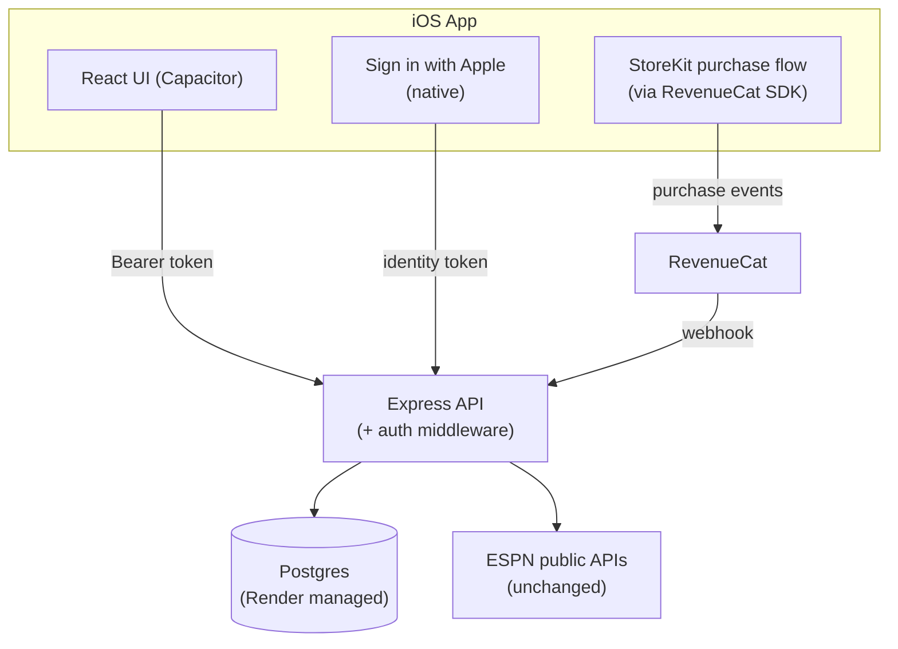

# App Store + Accounts + Paywall — Design Doc

## 1. What this covers

A plan to take Alumni Watch from "sideloaded onto one phone via Xcode, no
accounts, no persistence beyond localStorage" to a real App Store release
with a free/paid split: **3 saved players free, unlimited on a paid
subscription.**

This is a genuinely large jump from where the app is today (see
`docs/DESIGN.md` for the current architecture) — it adds three subsystems
that don't exist at all right now: accounts, a real database, and payments.
Nothing here is started yet; this is the plan to build from.

## 2. Why this is bigger than it sounds

Today, "My Roster" is enforced by nothing — it's a JSON array in the
browser's localStorage, and the Express API (`server/src/index.js`) has no
concept of a user at all: every endpoint is anonymous and stateless. A
paywall layered on top of that would be cosmetic — anyone can edit
localStorage and ignore it. Enforcing "3 free, unlimited paid" for real
means the roster has to move server-side, behind a real user account, with
the limit checked on every write. That one requirement is what pulls in
accounts and a database as prerequisites, not optional extras.

## 3. Target architecture



Two new external dependencies: Apple's Sign in with Apple (native, no
account of our own to run) and RevenueCat (free tier covers this app's
scale — wraps StoreKit + receipt validation + subscription-state webhooks
so this app never talks to Apple's raw App Store Server API directly).

## 4. Data model

Three new tables, added to a Postgres database (Render's managed Postgres —
same platform already hosting the API, one less thing to operate
separately). The free tier there expires after 90 days; a real launch needs
the paid tier (~$7-19/mo).

| Table | Columns | Notes |
|---|---|---|
| `users` | `id`, `apple_user_id` (unique), `email` (Apple's relay email, nullable), `created_at` | One row per Sign in with Apple identity. No password to store. |
| `saved_players` | `id`, `user_id`, `player_id`, `player_name`, `position`, `team_id`, `team_name`, `team_logo`, `year`, `saved_at` | Replaces the `useSavedPlayers.js` localStorage array — same fields, now server-side and user-scoped. |
| `entitlements` | `user_id`, `tier` (`free`\|`unlimited`), `revenuecat_id`, `renews_at`, `updated_at` | Updated by the RevenueCat webhook on purchase/renewal/cancellation/refund. |

The free/paid check is one query on every save attempt:

```
allowed = tier == 'unlimited' OR count(saved_players WHERE user_id = X) < 3
```

That check has to live in the API (`POST /api/saved-players` or equivalent),
never in the client — the client can suggest the limit for UX (graying out
the save button, showing the paywall), but the server is the only thing
allowed to actually enforce it.

## 5. Auth: Sign in with Apple only

Chosen over adding email/password or magic-link because it's a one-tap flow
already native to iOS, requires no email-sending infrastructure, and is
what Apple pushes toward anyway once any third-party login exists. The
tradeoff, taken deliberately: **the web version (the Render-deployed site)
has no login path in this plan** — accounts and the paywall are an iOS-app-
only concept for now. The free web experience (one-off lookups, no saved
roster) keeps working exactly as it does today; saving a roster becomes an
iOS-app-with-account feature. Adding a web login path later is possible but
out of scope here.

Flow: the native Sign in with Apple prompt returns an identity token to the
app; the app sends that token to a new `POST /api/auth/apple` endpoint;
the server verifies it against Apple's public keys, creates or looks up the
`users` row, and returns a session token (a signed JWT is enough — no
separate session store needed) that the app attaches to every subsequent
API call.

## 6. Paywall: RevenueCat + StoreKit

- One subscription product in App Store Connect (e.g. "Unlimited Roster,"
  ~$2.99/mo — exact price is a business decision, trivially changed later
  in App Store Connect without touching code).
- RevenueCat's Capacitor SDK wraps the native purchase flow — the app never
  talks to StoreKit directly.
- A paywall screen appears when a free user hits the 3-player limit:
  purchase button, price, and a **Restore Purchases** button (Apple
  requires this exact affordance — its absence is a common rejection
  reason).
- RevenueCat calls our webhook on every entitlement change (new purchase,
  renewal, cancellation, refund, billing-issue grace period); the webhook
  handler updates the `entitlements` row. The API's save-check always reads
  from that table, never from anything the client asserts about itself.

## 7. Migrating existing local rosters

Right now every saved roster lives only in one browser's localStorage on
one device. Recommended: on first Sign in with Apple, if localStorage has a
saved-players array, POST it once to a `/api/saved-players/import` endpoint
that inserts anything not already present (respecting the free-tier limit —
if someone already saved 8 players locally before accounts existed, import
the first 3 and surface the rest as "these need Unlimited Roster to
restore"). This is a nice-to-have, not a hard blocker — the alternative is
just accepting that switching to accounts is a clean-slate reset — but it's
cheap enough to build that it's worth doing.

## 8. App Store submission checklist

Separate from the engineering above — mostly one-time admin work:

- Apple Developer Program enrollment ($99/year — the fee this whole project
  originally set out to avoid before deciding to actually ship).
- Real app icon (currently only a headshot placeholder SVG exists anywhere
  in the app) — needs a 1024×1024 source image, Xcode generates the rest.
- Screenshots across the required device sizes.
- A real privacy policy page — non-optional once the app has accounts and
  payments, and needs to accurately describe what's collected (Apple ID
  relay email, saved-player data, subscription status via RevenueCat).
- Age rating questionnaire.
- Subscription terms displayed per App Store Review Guideline 3.1.2
  (RevenueCat's paywall templates handle this correctly out of the box).
- A TestFlight beta pass is worth doing before public submission — catches
  the kind of Xcode-signing gotchas already hit once in this project.
- One honest risk to flag: Apple reviewers occasionally scrutinize apps
  built on unofficial/scraped data sources (ESPN's public API isn't an
  official partner integration). Usually survivable, but not a zero-risk
  line item, and not something fixable in advance — it's a review-time
  judgment call.

## 9. Cost summary

| Item | Cost |
|---|---|
| Apple Developer Program | $99/year |
| Render Postgres (production tier) | ~$7-19/month |
| RevenueCat | Free up to $2.5k/month tracked revenue |
| Email sending | $0 (not needed — Sign in with Apple only) |

## 10. Suggested build order

1. **Database + schema** — stand up Postgres on Render, add the three
   tables, no user-facing change yet.
2. **Auth** — Sign in with Apple end to end (native prompt → token
   verification → session issuance), gated behind a feature flag or just
   built on a branch, since it doesn't need to ship until paired with...
3. **Server-scoped roster** — move `saved_players` from localStorage to the
   API, behind auth, with the 3-player free check in place (this alone
   makes the free tier real, before payments exist).
4. **Local-roster import** — the one-time migration flow from §7.
5. **RevenueCat + paywall screen** — the actual upgrade path, wired to the
   entitlement check already built in step 3.
6. **App Store submission assets + review** — icon, screenshots, privacy
   policy, TestFlight, submit.

Each step is independently useful and testable on its own — this doesn't
need to be one giant change landed at once.
