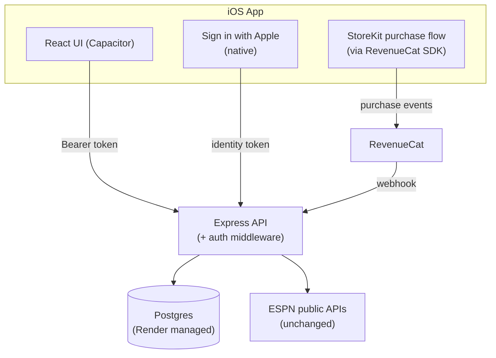

# App Store + Accounts + Paywall — Design Doc

## 1. What this covers

The plan — now built — for taking Alumni Watch from "sideloaded onto one
phone via Xcode, no accounts, no persistence beyond localStorage" to a real
App Store release with a free/paid split: **3 saved players free,
unlimited on a paid subscription.**

**Status: built and submitted.** Every subsystem below (accounts, Postgres,
Sign in with Apple, RevenueCat/StoreKit) exists in the codebase and is live
against a real App Store Connect app record and a real RevenueCat project.
This doc is kept as the design record (why each decision was made) rather
than rewritten as a pure status report — treat it as accurate for *intent*;
see `CLAUDE.md` for a terser "what actually exists today" summary and the
handful of naming/gotcha details (e.g. the RevenueCat entitlement
identifier vs. the `tier` column) worth knowing before touching this code.

## 2. Why this is bigger than it sounds

Today, "My Roster" is enforced by nothing — it's a JSON array in the
browser's localStorage, and the Express API (`server/src/index.js`) has no
concept of a user at all: every endpoint is anonymous and stateless. A
paywall layered on top of that would be cosmetic — anyone can edit
localStorage and ignore it. Enforcing "3 free, unlimited paid" for real
means the roster has to move server-side, behind a real user account, with
the limit checked on every write. That one requirement is what pulls in
accounts and a database as prerequisites, not optional extras.

## 3. Target architecture



Two new external dependencies: Apple's Sign in with Apple (native, no
account of our own to run) and RevenueCat (free tier covers this app's
scale — wraps StoreKit + receipt validation + subscription-state webhooks
so this app never talks to Apple's raw App Store Server API directly).

## 4. Data model

Three new tables, added to a Postgres database (Render's managed Postgres —
same platform already hosting the API, one less thing to operate
separately). The free tier there expires after 90 days; a real launch needs
the paid tier (~$7-19/mo).

| Table | Columns | Notes |
|---|---|---|
| `users` | `id`, `apple_user_id` (unique), `email` (Apple's relay email, nullable), `created_at` | One row per Sign in with Apple identity. No password to store. |
| `saved_players` | `id`, `user_id`, `player_id`, `player_name`, `position`, `team_id`, `team_name`, `team_logo`, `year`, `saved_at` | Replaces the `useSavedPlayers.js` localStorage array — same fields, now server-side and user-scoped. |
| `entitlements` | `user_id`, `tier` (`free`\|`unlimited`), `revenuecat_id`, `renews_at`, `updated_at` | Updated by the RevenueCat webhook on purchase/renewal/cancellation/refund. `tier` is this app's own internal name and is unrelated to the RevenueCat *entitlement identifier* configured in their dashboard (`alumni_watch_pro`) — don't assume the two should match, they're two different systems' vocabulary for the same underlying fact. |

The free/paid check is one query on every save attempt:

```
allowed = tier == 'unlimited' OR count(saved_players WHERE user_id = X) < 3
```

That check has to live in the API (`POST /api/saved-players` or equivalent),
never in the client — the client can suggest the limit for UX (graying out
the save button, showing the paywall), but the server is the only thing
allowed to actually enforce it.

## 5. Auth: Sign in with Apple only

Chosen over adding email/password or magic-link because it's a one-tap flow
already native to iOS, requires no email-sending infrastructure, and is
what Apple pushes toward anyway once any third-party login exists. The
tradeoff, taken deliberately: **the web version (the Render-deployed site)
has no login path in this plan** — accounts and the paywall are an iOS-app-
only concept for now. The free web experience (one-off lookups, no saved
roster) keeps working exactly as it does today; saving a roster becomes an
iOS-app-with-account feature. Adding a web login path later is possible but
out of scope here.

Flow: the native Sign in with Apple prompt returns an identity token to the
app; the app sends that token to a new `POST /api/auth/apple` endpoint;
the server verifies it against Apple's public keys, creates or looks up the
`users` row, and returns a session token (a signed JWT is enough — no
separate session store needed) that the app attaches to every subsequent
API call.

## 6. Paywall: RevenueCat + StoreKit

- One subscription product in App Store Connect: "Unlimited Roster
  Monthly," product id `com.alumniwatch.app.unlimited`, $2.99/mo, in a
  subscription group named "Alumni Watch Pro."
- RevenueCat's Capacitor SDK (`@revenuecat/purchases-capacitor`) wraps the
  native purchase flow — the app never talks to StoreKit directly.
  `Purchases.configure()`/`logIn(userId)` happen in
  `web/src/useAccountRoster.js` right after Sign in with Apple succeeds (or
  on relaunch, for a restored session), using this app's own numeric user
  id as RevenueCat's `app_user_id` — that's what lets the webhook (below)
  map an event straight back to a user with no separate identity table.
- `PaywallNotice.jsx` is the paywall UI: purchase button, price (pulled
  from `Purchases.getOfferings()`, not hardcoded), and a **Restore
  Purchases** button (Apple requires this exact affordance — its absence
  is a common rejection reason). It's a shared component rendered from
  both the My Roster tab and the player card's own Save button, since
  either one can trigger the limit.
- RevenueCat calls `POST /api/webhooks/revenuecat` on every entitlement
  change (new purchase, renewal, cancellation, refund, billing-issue grace
  period); the handler updates the `entitlements` row keyed by that numeric
  user id. The API's save-check always reads from that table, never from
  anything the client asserts about itself. The RevenueCat-side entitlement
  identifier is `alumni_watch_pro` — see the note in §4.
- A real gotcha hit during first submission, worth remembering for any
  future subscription/IAP added to this app: a brand-new app's *first*
  auto-renewable subscription must be submitted to Apple together with an
  actual app build — it sits in "Prepare for Submission" indefinitely
  otherwise, even once every one of its own fields is filled in correctly.

## 7. Migrating existing local rosters — built

`POST /api/saved-players/import` (backed by `importSavedPlayers()` in
`accounts.js`) inserts anything not already present, respecting the
free-tier limit — reporting `{imported, skipped}` rather than failing the
whole batch if someone had more than 3 players saved locally before
accounts existed. `SavedPlayersContext.jsx` calls it once, automatically,
right after a successful native sign-in.

## 8. App Store submission checklist — done, submitted

- Apple Developer Program enrollment — done.
- App icon (`web/resources/icon.png`) and launch screen
  (`web/resources/splash.png`) — done; `npm run generate:assets`
  (`@capacitor/assets`) regenerates every Xcode-required size from those
  two source files.
- Screenshots (iPhone 6.5"/6.7" + 13" iPad, plus a dedicated subscription
  review screenshot) — done. Apple's exact required pixel dimensions for
  these are worth re-checking against current docs each time, rather than
  reusing a size that was correct previously — they've changed before.
- Privacy policy (`server/public/privacy.html`) and support page
  (`server/public/support.html`) — done, served directly by the Express
  app at `/privacy.html` and `/support.html` so they have stable URLs
  independent of the SPA's own routing. Content matches what's actually
  declared in App Store Connect's App Privacy questionnaire (Identifiers,
  Contact Info, User Content, Purchases — all "App Functionality," none
  "used to track").
- Age rating questionnaire — answered, landed at 4+.
- Subscription terms/Restore Purchases — done, see §6.
- Content Rights declaration — answered "yes, contains third-party content
  (ESPN's public sports data/logos), have the necessary rights/basis to
  use it" — a judgment call, not a guaranteed-safe answer; flagged here so
  it isn't silently re-decided differently later.
- The unofficial-data-source review risk noted below is still real and
  unresolved either way — it can only be judged at actual review time, and
  hasn't come up as a rejection reason yet as of this writing.

## 9. Cost summary

| Item | Cost |
|---|---|
| Apple Developer Program | $99/year |
| Render Postgres (production tier) | ~$7-19/month |
| RevenueCat | Free up to $2.5k/month tracked revenue |
| Email sending | $0 (not needed — Sign in with Apple only) |

## 10. Build order followed — all done

1. **Database + schema** — Postgres on Render, `server/db/migrations/001_init.sql`.
2. **Auth** — Sign in with Apple end to end (`server/src/auth.js`).
3. **Server-scoped roster** — `saved_players` behind auth, 3-player free
   check in `accounts.js`'s `savePlayerForUser`.
4. **Local-roster import** — §7.
5. **RevenueCat + paywall screen** — §6.
6. **App Store submission assets + review** — §8; submitted, awaiting
   Apple's review outcome as of this writing.

If you're picking this project back up: check with the user for the
current App Store Connect review status rather than assuming — that state
lives outside this repo and isn't discoverable from the code.
