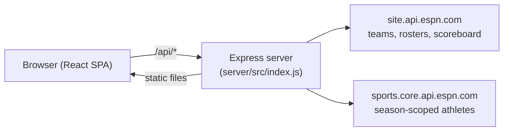

# Alumni Watch — Design Doc

## 1. What this is

Pick a college football team and season — or a specific subset of players from
that roster — and see which of this week's NFL games are worth watching
because alumni from that team are playing in them.

The product idea has three steps:

1. **Pick players**: a whole college team/season, individually chosen players
   from a roster, or a saved cross-team list built up over time.
2. **Find them in the pros**: cross-reference those players against current
   NFL rosters.
3. **Recommend games**: match their current NFL teams against this week's
   schedule and rank games by how many alumni are playing in each.

## 2. The idea that makes this possible

The original plan was to use a paid/keyed college-football data API
(CollegeFootballData.com) for historical rosters, cross-referenced against a
separate source (Sleeper) for current NFL teams. Signup friction on the paid
API forced a rethink, and it turned out to be a better design anyway:

**ESPN's public, unauthenticated APIs cover the whole pipeline by
themselves**, because ESPN assigns one athlete ID per person that's shared
across every sport and every season. The same numeric ID that identifies a
player on a 2018 college roster identifies them on an NFL roster years later.
That single fact is what lets this app go straight from "college roster in a
given year" to "current NFL team" with no separate identity-matching step,
no fuzzy name matching, and no paid API.

Three ESPN endpoint families are used:

| Purpose | Endpoint | Auth |
|---|---|---|
| College team list | `site.api.espn.com/.../college-football/teams` | none |
| Season-scoped college roster | `sports.core.api.espn.com/.../seasons/{year}/teams/{id}/athletes` | none |
| Current NFL team rosters (all 32) | `site.api.espn.com/.../nfl/teams/{id}/roster` | none |
| This week's NFL schedule | `site.api.espn.com/.../nfl/scoreboard` | none |

## 3. System architecture

One Node process does both jobs: it serves the JSON API under `/api/*` and
serves the built React app (`web/dist`) for everything else, with an SPA
fallback to `index.html`. That's a deliberate simplification — it means one
deployable service instead of two, which matters for hosting on a free tier
(see [§7](#7-deployment)).

- `server/` — Express API + ESPN client (`espnClient.js`) + in-memory cache.
- `web/` — Vite + React single-page frontend.

## 4. The stale-team-field bug (why current rosters aren't trusted at face value)

This was the most important data-correctness decision in the build, found
during manual testing, not designed for up front.

An NFL athlete's own record (`GET .../nfl/athletes/{id}`) includes a `team`
field. The obvious approach is to trust it. It's wrong: once a player leaves
a roster (cut, hits free agency), ESPN keeps that field pointing at their
*most recent* team rather than clearing it. A concrete example caught during
testing: Austin Bryant's athlete record reported `status: "Free Agent"` but
`team: San Francisco 49ers` — and he was not actually on the 49ers' roster.
Trusting that field would have recommended games based on players who
weren't actually going to play in them.

**Fix**: instead of asking "what does this player's own record say their
team is," the app asks "does any of the 32 current team rosters actually
list this player." `getNflRosterIndex()` in `espnClient.js` fetches all 32
team rosters once, builds an `athleteId → team` map from actual roster
membership, and that index — not the athlete's self-reported `team` field —
is the source of truth for "where do they play now." A player who isn't on
any of the 32 rosters is correctly dropped as "not currently in the NFL,"
regardless of what their own record's stale field says.

## 5. Backend design

### Caching

Everything ESPN-derived is cached in memory for the life of the server
process (no TTL, no persistence — see [§6](#6-persistence-why-localstorage-not-a-backend-database)
for why). Cache keys, all in `espnClient.js`:

- `collegeTeams` — the full ~759-team list (see [§7](#7-a-truncation-bug-found-after-shipping) for a bug this had).
- `nflTeams` — the 32 NFL teams, id → `{name, abbreviation, logo}`.
- `rosters` — keyed by `` `${teamId}:${year}` ``, one entry per team/season pulled.
- `nflRosterIndex` — the athleteId → current-team map from [§4](#4-the-stale-team-field-bug-why-current-rosters-arent-trusted-at-face-value), built once and reused.

### Why roster fetches are slow the first time and fast after

ESPN's season-scoped roster endpoint only returns `$ref` links, not full
player data — getting names and positions for a ~150-170 player roster means
one follow-up request per player. `mapWithConcurrency()` runs these with a
concurrency cap (25 in flight at once) rather than serially, which is the
difference between a ~2-3 second first load and something much worse. Once a
team/year has been pulled, it's cached and instant on repeat.

### Endpoints

| Method & path | Purpose |
|---|---|
| `GET /api/college-teams` | Full team list for the search picker. |
| `GET /api/roster?teamId=&year=` | Season roster (id, name, position, jersey). |
| `GET /api/week-games` | This week's NFL schedule. |
| `GET /api/recommendations?teamId=&year=&playerIds=` | One team's roster (or a subset via `playerIds`) → alumni → games to watch. |
| `POST /api/alumni-lookup` | Same recommendation logic, but for an arbitrary player list (id/name pairs) instead of one team's roster — powers the cross-team "My Roster" list. |

`/api/recommendations` and `/api/alumni-lookup` share one implementation,
`buildRecommendations(players)`, so the matching/ranking logic (alumni →
current team → this week's game → sorted by alumni count) only exists once.

## 6. Frontend design

Single-page app, no routing library — a `view` state toggle switches between
two tabs:

- **Search teams**: `TeamPicker` (typeahead over the team list) + a year
  input + `RosterList` showing that team's roster.
- **My roster**: `RosterList` showing the saved cross-team list.

`RosterList` (`web/src/components/RosterList.jsx`) is the same component in
both tabs, parameterized by a `rowAction` render prop (a star/save button in
the search tab, a remove button in the saved tab) and an optional team badge.
It owns its own name-filter and position-dropdown state internally, since
that's a pure display concern that doesn't need to live in `App.jsx`.
`ResultsPanel` (the games-to-watch output) is likewise shared — it renders
whatever `{recommendations, allAlumni, week, ...}` shape either backend
endpoint returns, without needing to know which tab produced it.

## 7. Persistence: why localStorage, not a backend database

The "My Roster" feature (save players across different team searches, come
back to them later without re-searching) needs *something* to persist
across visits. That storage was deliberately put in the browser
(`web/src/useSavedPlayers.js`, backed by `localStorage`) instead of on the
server, for one concrete reason: **Render's free tier has an ephemeral
filesystem** — anything a server process writes to disk is gone on the next
restart or redeploy. A JSON file on the server would have looked like
persistence in a dev session and then quietly lost data in production.
localStorage, despite being "just the browser," is actually the more
durable option available without adding real infrastructure.

The trade-off is explicit and worth stating: saved players are scoped to one
browser on one device. There's no login system, so there's no concept of
"your" roster across devices. Making that sync would mean adding real
accounts and a real database — a deliberate scope line, not an oversight
(see [§9](#9-known-limitations)).

## 8. Deployment

`server/src/index.js` serves the built frontend directly
(`express.static(web/dist)` + an SPA fallback route), so the whole app is one
deployable web service. `render.yaml` defines a Render Blueprint: install
both `server/` and `web/`, run `vite build`, and start the Express server,
which then serves both the API and the compiled app from one process on one
free-tier instance.

One environment quirk worth documenting: Node's built-in `fetch` does not
read `HTTPS_PROXY`/`https_proxy` by default (unlike most other HTTP
clients). The `server/package.json` scripts set `NODE_USE_ENV_PROXY=1` so
that outbound ESPN calls work correctly in network environments that require
an explicit proxy (this repo's own dev sandbox included). It's a no-op
anywhere a proxy isn't configured, so it's safe to leave on in every
environment rather than special-casing it.

## 9. Known limitations

- **No accounts / no cross-device sync** — see [§7](#7-persistence-why-localstorage-not-a-backend-database).
- **No validation on year vs. team existence** — asking for a team's roster
  in a year before the program existed (or after) just returns an empty
  roster rather than a helpful error.
- **Free-tier cold starts** — after ~15 minutes idle, Render's free plan
  spins the service down; the first request afterward takes 30-60s to wake
  it back up.
- **Roster data noise** — ESPN's season rosters occasionally include
  placeholder/incomplete entries (e.g. walk-ons with truncated names) since
  it's sourced from their public roster data, not a curated dataset.
- **Recommendations don't account for game-day inactives** — a player shows
  up as a reason to watch a game as long as they're on the active roster,
  regardless of whether they're actually active/healthy for that specific
  week's game.

## 10. Possible future work

- Real accounts + a database, if cross-device sync for "My Roster" becomes
  worth the added infrastructure.
- Extend beyond NFL/college football to other league/feeder pairs the same
  athlete-ID-sharing trick might work for.
- Surface each alum's snap counts / recent usage, not just "on the roster,"
  to better answer "is this actually worth watching for them."
